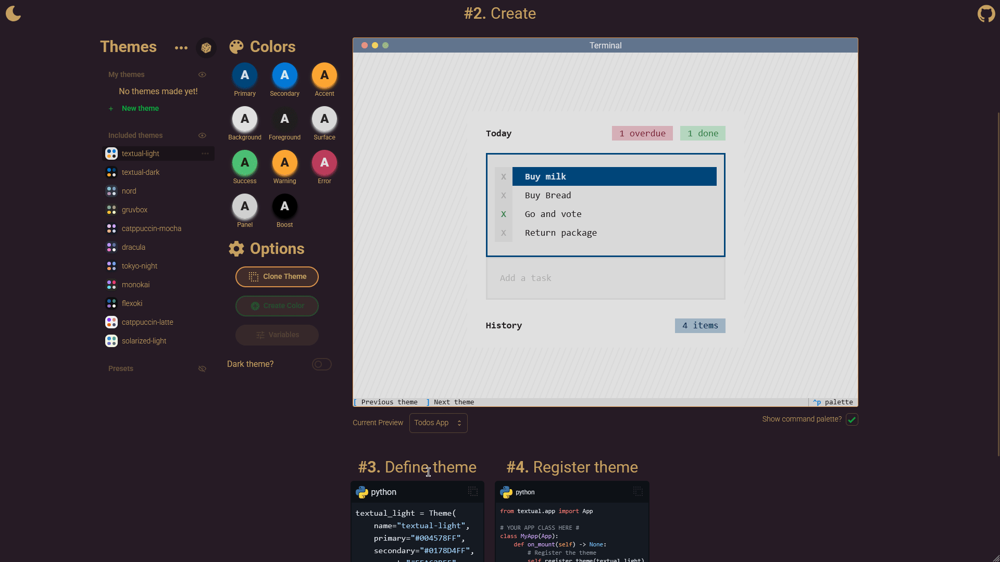

# <p align="center">Textual Theme Generator</p>

A modern, highly interactive theme generator and playground for [Textual](https://textual.textualize.io/) <br /> and other UI frameworks, built with [SolidJS](https://www.solidjs.com/), [SolidStart](https://start.solidjs.com/), [Tailwind CSS](https://tailwindcss.com/), and [DaisyUI](https://daisyui.com/).

[](https://nodejs.org/)
[](https://bun.sh/)
[](https://ttg.xtreat.dev/)

[](https://github.com/xandertreat/textual-theme-gen/actions)
[](./coverage/index.html)
[](https://img.shields.io/badge/maintained-yes-brightgreen)
[](https://github.com/xandertreat/textual-theme-gen/commits/main)

[](https://github.com/xandertreat/textual-theme-gen/issues)
[](https://github.com/xandertreat/textual-theme-gen/pulls)
[](#contributors)

[](https://github.com/xandertreat/textual-theme-gen/blob/main/LICENSE)
[](https://biomejs.dev/)

[](https://github.com/xandertreat/textual-theme-gen/fork)
[](https://github.com/xandertreat/textual-theme-gen)
[](https://visitor-badge.laobi.icu/badge?page_id=xandertreat.textual-theme-gen)

---

## 📺 Demo

A quick look at the app in action:



> Want to see more? Try the [live demo](https://ttg.xtreat.dev/)!

---

## 💬 User Feedback

We welcome feedback from everyone—not just developers! If you have ideas, questions, run into issues, or just want to share your thoughts, please [open an issue](https://github.com/xandertreat/textual-theme-gen/issues) or [start a discussion](https://github.com/xandertreat/textual-theme-gen/discussions) (if enabled).

No technical knowledge required—just let us know what you think!

---

## 🚀 Features

- 🎨 Visual theme creation, editing, and previewing
- 🌓 Light/dark mode support with instant switching
- 🧩 Modular, reactive SolidJS components
- 💾 Local storage for persistent themes / configuration
- 📦 Import/export themes as JSON
- 🛠️ Advanced color manipulation
- 🧪 Unit and integration tests with Vitest
- 🏗️ Modern build tooling (Vinxi, Bun, Vite)
- 🧹 Linting, formatting, and CI-ready
- 🔥 Blazingly fast
- ...and more!

---

## 📦 Getting Started

### Prerequisites

- [Node.js](https://nodejs.org/) v20+
- [Bun](https://bun.sh/) (for project management)

### Installation

```sh
bun install # or npm install, pnpm install, yarn install
```

### Development

```sh
bun run dev # or npm run dev
```

### Building for Production

```sh
bun run build # or npm run build
```

### Running Tests

```sh
bun test # or npm test
```

### Linting & Formatting

```sh
bun check      # Lint everything
bun format     # Format all files
bun format:check # Check formatting
bun lint:fix      # Automatically fix linting issues
```

---

## 🗺️ Project Structure

```plaintext
src/
  app.tsx                # App entry
  assets/styles/app.css  # Tailwind, DaisyUI, custom styles
  components/            # UI primitives (Icon, Dialog, CodeBlock, etc.)
  context/               # App/theme context providers
  features/themes/       # Theme management, editing, preview, etc.
  lib/                   # Utilities (debounce, lru, etc.)
  routes/                # SolidStart routes
  ...
public/                  # Static assets, icons, manifest
```

---

## 🏛️ Architecture & Dependencies

- **SolidJS** for fine-grained reactivity and composable UI
- **Context Providers** for scoped shared state
- **Tailwind CSS** for atomic inline styling
- **DaisyUI** for accessible, beautiful UI components
- **LocalStorage** for user data storage
- **Color manipulation** via `color` package
- **Kobalte/Corvu** Solid.js component libraries

---

## 🖥️ Usage Guide

### Creating a Theme

1. Click "New Theme"
2. Enter a name (letters, numbers, hyphens)
3. Choose light/dark
4. Edit colors, variables, etc.
5. Save and preview instantly on edit

### Importing/Exporting Themes

- Use the Import/Export buttons in the UI to share or use pre-existing themes.

### Cloning & Deleting

- Clone any theme for quick variations
- Delete themes (user themes only) with confirmation dialogs

### Advanced Editing

- Edit color shades, variables, and more (coming soon)

---

## 🧪 Testing & Quality

- Unit tests: `tests/unit/`
- Integration tests: `tests/integration/`
- Linting: Biome (& tsc)
- Formatting: Biome
- CI: See `package.json` scripts

---

## 🤝 Contributing

- Fork and clone the repo
- Create a new branch (`(feat/fix)/descriptive-name`)
- Run `bun run dev` and hack away!
- Add/modify tests as needed
- Open a PR with a clear description of the implementation and purpose

### Code Style

- Use Biome for linting/formatting
- Follow existing component and file structure
- Prefer functional, composable components

---

## 📋 TODOs & Roadmap

- [ ] Implement dark shade generation for colors (`// TODO: implement, allow users to manage and generate, integrate etc.`)
- [ ] Use `cn` utility everywhere for class merging, when appropriate (`// TODO: use cn everywhere in codebase`)
- [ ] Finish variables management UI (`Coming soon...` in VariablesManagement)
- [ ] Finish new color dialog (`Coming soon...` in NewColor)
- [ ] Fix theme icon bug on startup (`// TODO: fix weird bug where starting theme icon disappears?`)
- [ ] Add more unit/integration tests
- [ ] Improve accessibility (ARIA, keyboard nav, etc.)
- [ ] Add more documentation (architecture, theming guide, etc.)
- [ ] Responsive polish: review all breakpoints, container queries, fluid typography
- [ ] Add ability to "link" colors together if they can / do have relationships
- [ ] Add accessibility checks for colors (i.e. WACG text contrast)
- [ ] Add further options for derived colors / variables to include in code bundle
- [ ] Fully support variables
- [ ] Localization / Internationalization

---

## 📝 License

[MIT](LICENSE)

---

## Contributors

<!-- ALL-CONTRIBUTORS-LIST:START - Do not remove or modify this section -->
<!-- prettier-ignore-start -->
<!-- markdownlint-disable -->

<!-- markdownlint-restore -->
<!-- prettier-ignore-end -->

<!-- ALL-CONTRIBUTORS-LIST:END -->

---

## 🙏 Acknowledgements

- [SolidJS](https://www.solidjs.com/)
- [Tailwind CSS](https://tailwindcss.com/)
- [DaisyUI](https://daisyui.com/)
- [Textual](https://textual.textualize.io/)
- [Color](https://github.com/Qix-/color)
- [Highlight.js](https://highlightjs.org/)
- [Iconify](https://iconify.design/)
- [Kobalte](https://kobalte.dev/) / [Corvu](https://corvu.dev/) (SolidJS component libraries)
- [Bun](https://bun.sh/) (runtime/tooling)
- [Vitest](https://vitest.dev/) (testing)
- [Biome](https://biomejs.dev/) (lint/format)
- [GSAP](https://gsap.com/) (animation)

---
