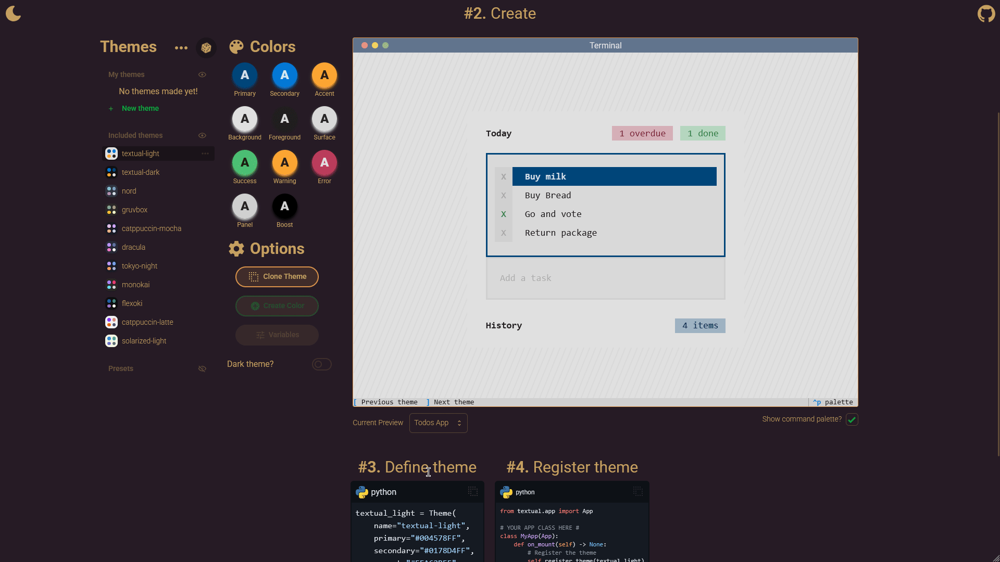

# 
Textual Theme Generator

A modern, highly interactive theme generator and playground for [Textual](https://textual.textualize.io/)   and other UI frameworks, built with [SolidJS](https://www.solidjs.com/), [SolidStart](https://start.solidjs.com/), [Tailwind CSS](https://tailwindcss.com/), and [DaisyUI](https://daisyui.com/).

---

## 📺 Demo

A quick look at the app in action:

> Want to see more? Try the [live demo](https://ttg.xtreat.dev)!

---

## 💬 User Feedback

We welcome feedback from everyone—not just developers! If you have ideas, questions, run into issues, or just want to share your thoughts, please [open an issue](https://github.com/xandertreat/textual-theme-gen/issues) or [start a discussion](https://github.com/xandertreat/textual-theme-gen/discussions) (if enabled).

No technical knowledge required—just let us know what you think!

---

## 🚀 Features

- 🎨 Visual theme creation, editing, and previewing
- 🌓 Light/dark mode support with instant switching
- 🧩 Modular, reactive SolidJS components
- 💾 Local storage for persistent themes / configuration
- 📦 Import/export themes as JSON
- 🛠️ Advanced color manipulation
- 🧪 Unit and integration tests with Vitest
- 🏗️ Modern build tooling (Vinxi, Bun, Vite)
- 🧹 Linting, formatting, and CI-ready
- 🔥 Blazingly fast
- ...and more!

---

## 🖥️ Usage Guide

### Creating a Theme

1. Click "New Theme"
2. Enter a name (letters, numbers, hyphens)
3. Choose light/dark
4. Edit colors, variables, etc.
5. Save and preview instantly on edit

### Importing/Exporting Themes

- Use the Import/Export buttons in the UI to share or use pre-existing themes.

### Cloning & Deleting

- Clone any theme for quick variations
- Delete themes (user themes only) with confirmation dialogs

### Advanced Editing

- Edit color shades, variables, and more (coming soon)

---

## 📋 TODOs & Roadmap

- [ ] Implement dark shade generation for colors (`// TODO: implement, allow users to manage and generate, integrate etc.`)
- [ ] Use `cn` utility everywhere for class merging, when appropriate (`// TODO: use cn everywhere in codebase`)
- [ ] Finish variables management UI (`Coming soon...` in VariablesManagement)
- [ ] Finish new color dialog (`Coming soon...` in NewColor)
- [ ] Fix theme icon bug on startup (`// TODO: fix weird bug where starting theme icon disappears?`)
- [ ] Add more unit/integration tests
- [ ] Improve accessibility (ARIA, keyboard nav, etc.)
- [ ] Add more documentation (architecture, theming guide, etc.)
- [ ] Responsive polish: review all breakpoints, container queries, fluid typography
- [ ] Add ability to "link" colors together if they can / do have relationships
- [ ] Add accessibility checks for colors (i.e. WACG text contrast)
- [ ] Add further options for derived colors / variables to include in code bundle
- [ ] Fully support variables
- [ ] Localization / Internationalization
- [ ] Icon package / refactor
- [ ] Pre-packaged colors to pick from (from textual's built in colors)
- [ ] Pagination for theme lists
